<div align="center">

# Gambit

Learn the patterns that beat games, then drill them

[![Live][badge-site]][url-site]
[![HTML5][badge-html]][url-html]
[![CSS3][badge-css]][url-css]
[![JavaScript][badge-js]][url-js]
[![Claude Code][badge-claude]][url-claude]
[![License][badge-license]](LICENSE)

[badge-site]:    https://img.shields.io/badge/live_site-0063e5?style=for-the-badge&logo=googlechrome&logoColor=white
[badge-html]:    https://img.shields.io/badge/HTML5-E34F26?style=for-the-badge&logo=html5&logoColor=white
[badge-css]:     https://img.shields.io/badge/CSS3-1572B6?style=for-the-badge&logo=css3&logoColor=white
[badge-js]:      https://img.shields.io/badge/JavaScript-F7DF1E?style=for-the-badge&logo=javascript&logoColor=black
[badge-claude]:  https://img.shields.io/badge/Claude_Code-CC785C?style=for-the-badge&logo=anthropic&logoColor=white
[badge-license]: https://img.shields.io/badge/license-MIT-404040?style=for-the-badge

[url-site]:   https://gambit.neorgon.com/
[url-html]:   #
[url-css]:    #
[url-js]:     #
[url-claude]: https://claude.ai/code

</div>

---

## Overview

Gambit teaches the pattern logic behind four games and then tests whether you actually
have it. Each game states the one rule its named patterns reduce to, shows the patterns
as cards you can read in seconds, and hands you scored positions against a clock. It is
built for people who pick up patterns fast and do not want a tutorial that walks them
through a first game.

Minesweeper gets the deepest treatment, including a solver that names the rule settling
each cell, a probability model for the moments when nothing is settled, and a Ruleset Lab
that measures how often a randomly dealt board is unwinnable. That last number is the
answer to a common and correct suspicion: two Minesweeper sites are frequently not
running the same game.

**Live:** gambit.neorgon.com

---

## Features

- **Pattern cards** -- name, diagram, the condition that fires it, and what it forces, grouped by whether you read it, derive it, or count it
- **One core rule per game** -- every named pattern is shown as an instance of it, so you derive rather than memorise
- **Scored drills** -- five levels per game, timed, with per-pattern accuracy tracked locally
- **Solver-derived answers** -- no drill answer is typed in by hand; positions are generated and then solved, so a wrong answer would require a wrong solver
- **Explain next move** -- in Minesweeper, names the rule that settles the next cell and highlights both the numbers doing the work and the cells they settle
- **Weighted mine odds** -- prices every guess correctly, including the binomial weighting that plain solution-counting gets wrong
- **The counter is a real equation** -- the solver uses the mines-remaining total, not just the numbers on the board, which is what makes the endgame deductions work
- **The Ruleset Lab** -- switch first-click policy, no-guess generation, chording, flag requirements and the mine counter, then measure what each one does
- **Post-mortem verdict** -- after a loss, tells you whether that board was solvable by logic at all
- **Runs entirely in the browser** -- no backend, no accounts, no network calls; the drill record lives in `localStorage`

---

## The games

| Game | Core rule it teaches |
|---|---|
| Minesweeper | Every number is an equation: the unknown neighbours of `n` hold `n` minus the mines already found |
| Chess | A tactic is one move creating two threats that one move cannot answer |
| Tollworks | Landing probability times rent, against cost. Sticker price is not that number |
| 2048 | Merges need equal neighbours, so the game is keeping the board sorted |

Tollworks is an original dice economy variant, not a copy of any published board game.
It exists to teach expected value, return on investment and cash buffer, which are the
concepts that category is built on.

---

## Running locally

ES modules require an HTTP server (not `file://`):

```bash
make serve
```

Then open http://localhost:8872.

---

## Testing the engines

The Minesweeper solver and probability model are checked against brute force, because
every drill answer and every teaching claim on the site depends on them being right.

```bash
node tests/run.mjs
```

It covers all four games: the Minesweeper solver and probability model in depth, the 2048
merge rule including the trap that clones get wrong, and every chess position's legality.

The suite verifies the named patterns produce the deductions the cards claim, that the
solver never marks a mine safe across thousands of random boards, and that the weighted
probabilities match an exhaustive enumeration of every consistent mine layout.

It also checks **completeness**, which matters more than it sounds. A solver that ignores
the mine counter is never wrong, it just calls forced positions guesses, and that is the
exact error this site is built to measure. The suite therefore requires the solver to find
everything a brute force finds, not merely to avoid claiming anything false.

---

## Architecture



```
gambit-site/
├── index.html                    # Shell: header, view tabs, modals
├── css/style.css                 # Site styles over the CDN token base
├── js/
│   ├── app.js                    # Entry point: register games, restore, render, wire
│   ├── registry.js               # The game module contract every game satisfies
│   ├── state.js                  # Shared state, settings, drill record, localStorage
│   ├── render.js                 # View tabs, game switcher, default pattern-card view
│   ├── events.js                 # All listeners, modal focus handling
│   ├── drills.js                 # Game-agnostic drill runner: levels, clock, scoring
│   ├── utils.js                  # el(), toast, shuffle, cooperative yielding
│   └── games/
│       ├── minesweeper/
│       │   ├── engine.js         # Board mechanics; every variant rule is a ruleset field
│       │   ├── solver.js         # The three local rules, and frontier enumeration
│       │   ├── probability.js    # Weighted mine odds, and what the mine counter settles
│       │   ├── analysis.js       # Combines both: what a player can actually prove
│       │   ├── generate.js       # Mine placement per first-click policy, no-guess search
│       │   ├── patterns.js       # The 13 pattern cards and their diagrams
│       │   ├── drill-gen.js      # Positions built then solved; answers are never authored
│       │   ├── drill-levels.js   # The five levels and their grading
│       │   ├── view.js           # Board renderer, shared by Play and Drill
│       │   ├── play.js           # Play view, Explain, Show odds, post-mortem verdict
│       │   └── rules.js          # The Ruleset Lab and the live measurement
│       ├── chess/
│       │   ├── puzzles.js        # 11 positions, each verified with python-chess
│       │   ├── board.js          # FEN rendering and click-to-move
│       │   ├── rules.js          # Official rules people misremember, and what varies
│       │   └── index.js          # Motif cards and the five levels
│       ├── economy/              # Tollworks: board, bot, expected-value drills
│       └── twenty48/             # 2048 with live anchor and monotonicity diagnostics
└── tests/run.mjs                 # 54 checks across all four games
```

---

<div align="center">
<sub>Part of <a href="https://neorgon.com/">Neorgon</a></sub>
</div>
